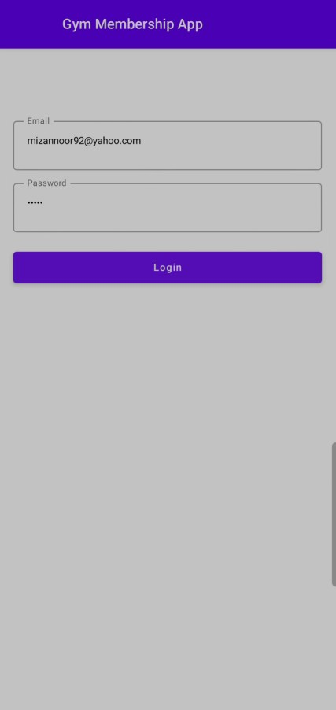
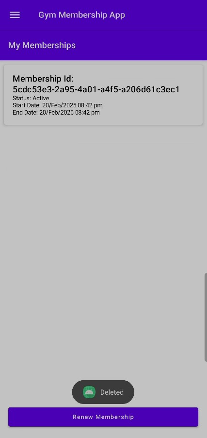
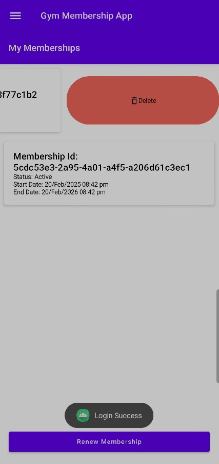
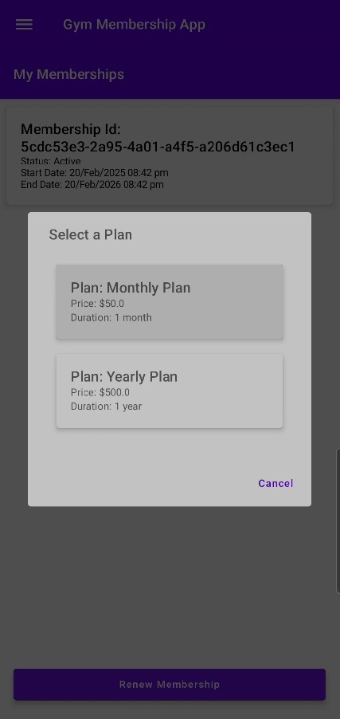
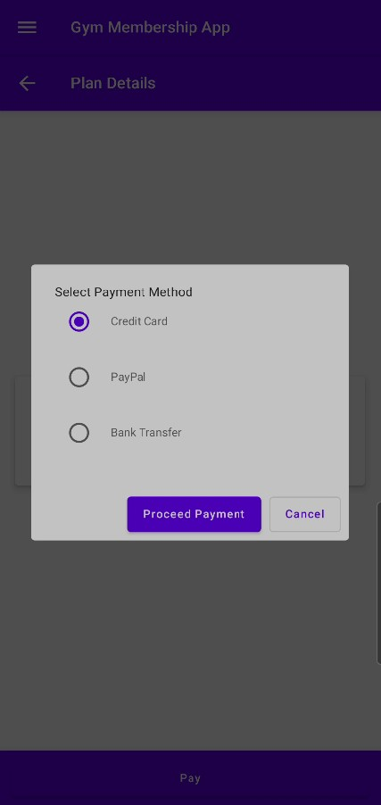
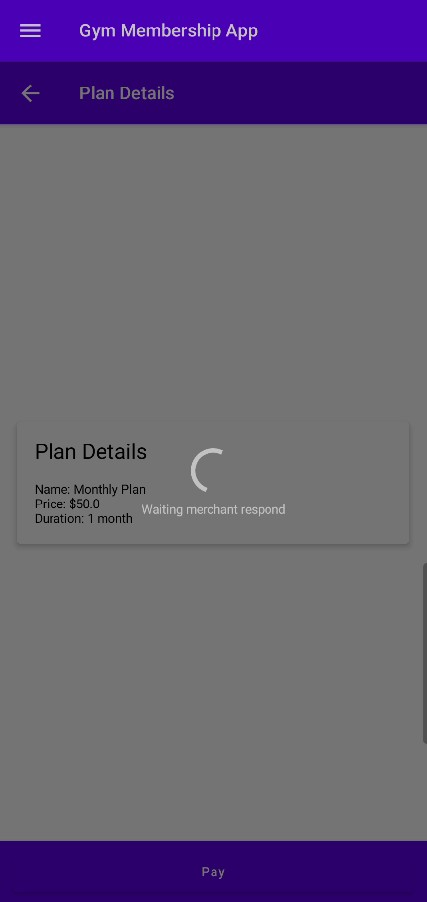
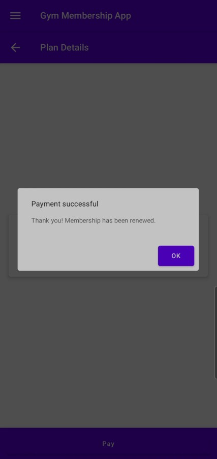
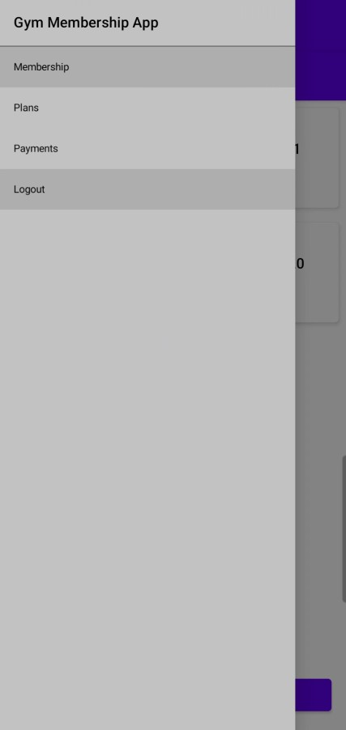

# GymMembership

## **1. Project Overview**

**Project Name:** **Gym Membership App**  
**Purpose:**  
This application is designed to **manage gym memberships** for users. It provides a **secure login/registration** mechanism, allows **viewing and renewing** memberships, and **handles payment** transactions. The **UI** is built with **Jetpack Compose**, offering a modern, reactive approach to Android development. Additionally, the app uses **Room** for local data persistence and **Retrofit** for server communication.

---

## **2. Technologies & Tools**

1. **Programming Language**  
   - **Kotlin**: The app is entirely written in Kotlin, leveraging **Jetpack Compose** for the UI layer.

2. **IDE**  
   - **Android Studio** (Arctic Fox or later). Gradle is used as the build system. The project is structured to be easily imported and built in Android Studio.

3. **Minimum & Target SDK**  
   - **minSdkVersion**: 24 (Android 7.0)  
   - **targetSdkVersion**: (latest stable, e.g., 33)  
   This ensures compatibility with a wide range of modern Android devices.

4. **Architecture Pattern**  
   - **MVVM (Model-View-ViewModel)**: Separates the UI logic (View) from the data handling (Model), with ViewModels acting as an intermediary for UI state.  
   - **Repository Pattern**: Each data domain (Membership, Payment, etc.) is handled by a dedicated repository class, making it straightforward to manage local/remote data sources.

---

## **3. Key Dependencies**

1. **Jetpack Compose**  
   - **Declarative UI** toolkit, providing a modern approach to building Android UI components.

2. **Hilt (Dagger-Hilt)**  
   - For **Dependency Injection**, ensuring easy instantiation of ViewModels, Repositories, and other classes without manual wiring.

3. **Retrofit + OkHttp**  
   - For **network calls** to the backend API. Retrofit handles REST requests and responses, while OkHttp is the underlying HTTP client.

4. **Room (Android Jetpack)**  
   - Provides a **local database** for storing user session details (like JWT tokens). Simplifies reading/writing user session info.

5. **Coroutines**  
   - Offers **asynchronous** execution (e.g., network requests, database operations) in a **clean**, non-blocking manner.

6. **Kotlinx DateTime** (optional)  
   - Helps with **date/time arithmetic** (e.g., adding 1 month/year). In some areas, you may rely on Java’s built-in date/time classes or the Node.js backend for advanced date handling.

---

## **4. Project Structure**

A simplified look at the **package** and **file organization**:

```
my.edu.utem.gymmembership
 ├── GymMembershipApp.kt           // @HiltAndroidApp (initializes Hilt)
 ├── MainActivity.kt               // @AndroidEntryPoint (sets up the app's entry point)
 ├── data/
 │   ├── local/
 │   │   ├── dao/
 │   │   │   └── UserSessionDao.kt  // Manages Room DB operations for user session
 │   │   ├── entity/
 │   │   │   └── UserSession.kt     // Entity representing a user session row
 │   │   └── AppDatabase.kt         // Room database class
 │   ├── remote/
 │   │   ├── model/                // Data classes: Membership, Payment, Plan, etc.
 │   │   └── network/              // Retrofit clients, interceptors, e.g. AuthInterceptor
 │   └── repository/               // Repositories (Auth, Membership, Payment, Plan, UserSession)
 ├── di/
 │   └── NetworkModule.kt          // Hilt module for providing Retrofit & DB instances
 ├── ui/
 │   ├── components/               // Reusable composables (dialogs, swipe-to-reveal, etc.)
 │   ├── navigation/               // Screen.kt or NavGraph for in-app navigation
 │   └── screen/                   // Login, Membership, Payment, PlanDetail, etc.
 ├── utils/
 │   └── DateUtils.kt              // Utility for date/time formatting
 └── viewmodel/
     ├── AuthViewModel.kt
     ├── MembershipViewModel.kt
     ├── PaymentViewModel.kt
     └── PlanViewModel.kt
```

### **Notable Directories**

- **`data/`**: Divided into `local` (Room) and `remote` (Retrofit). Repositories unify these data sources.  
- **`ui/screen`**: Each screen is a composable function (e.g., `MembershipScreen.kt`).  
- **`viewmodel`**: Contains the business logic for each domain (Auth, Membership, Payment, Plan).

---

## **5. Local Database**

- **Room**:  
  - The local DB holds **`UserSession`** (JWT token, userId, role).  
  - `UserSessionDao` offers insert, query, and clear operations.  
  - This ensures the app can quickly determine if a user is logged in without re-requesting from the server.

---

## **6. Backend & API**

The **backend** for this mobile app is located at:  
> **[https://github.com/mizannoor/MSMD5163-GYM-MEMBERSHIP](https://github.com/mizannoor/MSMD5163-GYM-MEMBERSHIP)**

**Backend Tech**:  
- **Node.js** with **Express**, possibly using MongoDB or another database for persistent storage.  
- **JWT** used for authentication. The app sends the token in the **Authorization header** for protected endpoints.

### **Main Endpoints**  
1. **Auth**  
   - `POST /login` – user login  
   - `POST /register` – user registration

2. **Membership**  
   - `GET /memberships` – fetch memberships  
   - `POST /memberships` – create membership  
   - `PUT /memberships/{id}` – update membership (e.g., status)  
   - `DELETE /memberships/{id}` – delete membership

3. **Plan**  
   - `GET /plans` – fetch plan list  
   - `GET /plans/{id}` – fetch single plan  
   - `DELETE /plans/{id}` – delete plan

4. **Payment**  
   - `GET /payments` – fetch payments  
   - `POST /payments` – create payment  
   - `PUT /payments/{id}` – update payment status  
   - `DELETE /payments/{id}` – delete payment

---

## **7. Application Flow**

1. **User Login**  
   - **LoginScreen** captures user email & password → calls `POST /login`.  
   - If successful, **AuthViewModel** stores token + user info in Room DB (`UserSession`).

2. **Membership Management**  
   - **MembershipScreen** calls `GET /memberships` to show a list of memberships.  
   - Users can **delete** or **renew**. Renewal triggers a plan selection → leads to `PlanDetailScreen`.

3. **Plan & Payment**  
   - **PlanDetailScreen** displays the chosen plan.  
   - User chooses a **payment method** in a popup.  
   - The app **creates** a membership (initially `"Inactive"`) and a **payment** (`"Pending"`).  
   - Payment is updated to `"Paid"`, membership is updated to `"Active"`.  
   - A success popup indicates membership renewal completion.

4. **Logout**  
   - Clears the local `UserSession` from Room, returning the app to the login state.

---

## **8. Screenshots**

The screenshots illustrate the flow:
1. **Login** screen with email/password fields.  



2. **Membership** screen listing memberships (with status, start/end dates).  



3. **Swipe** to delete membership.  



4. **Plan selection** popup.  



5. **Payment** method selection (radio buttons).  



6. **Loading overlay** with various steps (authorization, waiting, finalizing).  



7. **Success** popup after payment.



8. **Navigation drawer** with different sections (Membership, Plans, Payments, Logout).



---

## **9. Steps to Clone & Run the Project**

1. **Install Android Studio**  
   - Make sure you have Android Studio (Arctic Fox or later) installed on your machine.

2. **Clone from GitHub**  
   - Open a terminal or use Android Studio’s “Get from VCS” feature.  
   - Run:  
     ```bash
     git clone https://github.com/mizannoor/GymMembership.git
     ```
   - This creates a local copy of the project source.

3. **Open in Android Studio**  
   - In Android Studio, select **File → Open** (or **Open an existing project**).  
   - Navigate to the cloned **`GymMembership`** folder.  
   - Click **OK** to import the Gradle project.

4. **Configure SDK & Gradle**  
   - Ensure **minSdkVersion** and **targetSdkVersion** match your environment.  
   - Let **Gradle** synchronize dependencies.

5. **Run the App**  
   - Choose an **Android Emulator** or **physical device**.  
   - Click **Run** (the green triangle) to build and launch the app.

6. **Backend Setup**  
   - Clone and run the backend from:  
     [https://github.com/mizannoor/MSMD5163-GYM-MEMBERSHIP](https://github.com/mizannoor/MSMD5163-GYM-MEMBERSHIP)  
   - Make sure the base URLs in your **Retrofit** clients match your local or deployed server addresses.

---

## **10. Conclusion**

The **Gym Membership App** is a comprehensive Android application built with **Kotlin** and **Jetpack Compose**. It follows an **MVVM** architecture, using **Hilt** for dependency injection, **Retrofit** + **OkHttp** for REST API calls, and **Room** for local session storage. The **backend** is a **Node.js** Express server (available at [https://github.com/mizannoor/MSMD5163-GYM-MEMBERSHIP](https://github.com/mizannoor/MSMD5163-GYM-MEMBERSHIP)), supporting JWT-based authentication, membership management, and payment workflows.  

By leveraging modern Android best practices, the app provides a **secure, user-friendly** experience for logging in, renewing memberships, and handling payments with status updates.
